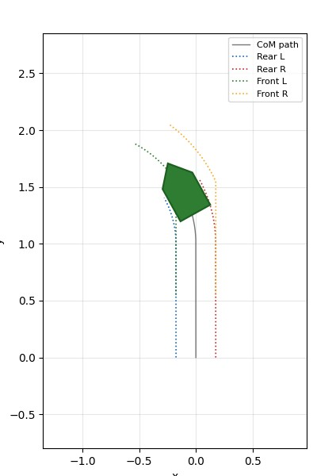
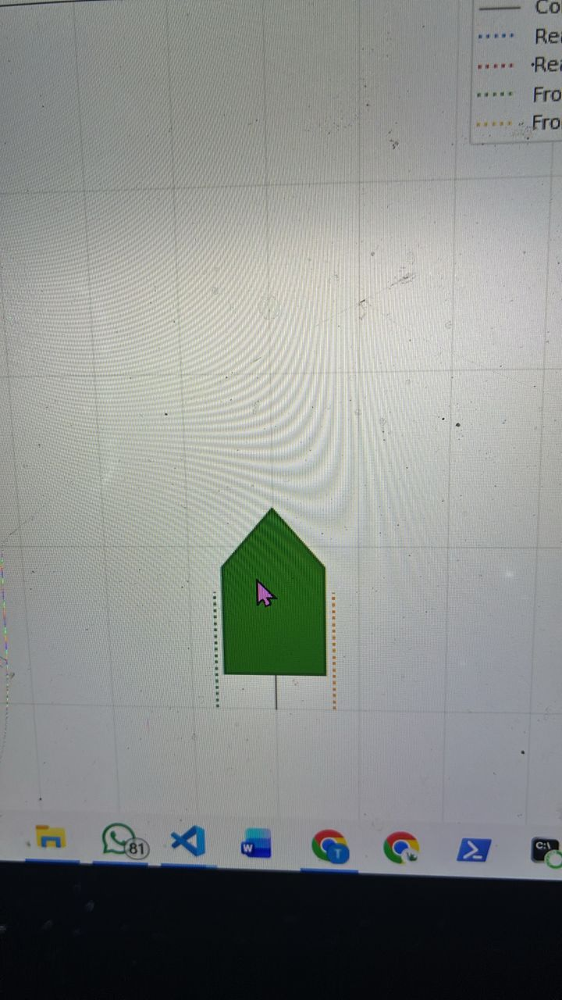
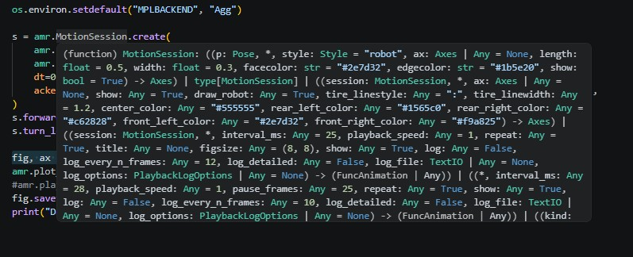

# Review and Comment on AuroraMR library
## Files commented
### 1. advanced/
    02_drive_to_pose_tolerances.py
    04_differential_wheels_timebased.py
    06_export_trajectories.py

### 2. class/
    05_differential.py
    06_ackermann.py

Observations and Suggestions
1. I noticed that the tracks for Ackerman steering appear vertically offset from the wheels would actually be. Upon further investigation i discovered that the wheelbase origin is at the vertical middle of the entire shape. Though this model works conceptually, it would look better if the wheels were fully under the rectangular part of the shape

3. The function signatures for many amr library functions are quite bulky, making it difficult to understand what arguments it takes at a glance. Formatting these properly as well as adding a brief description could really improve library interactivity
   
